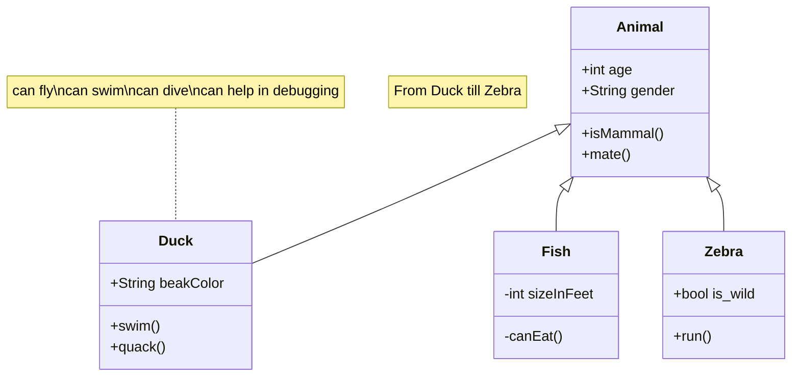

# Repositório de exemplo
Afim de incluir um exemplo para o projeto final da disciplina APS.




```python
def funcao_qualquer(arg1):
  print(Exemplo de uso do markdown com linguagem)
```

```shell
$ pip install meu_pacote
```
